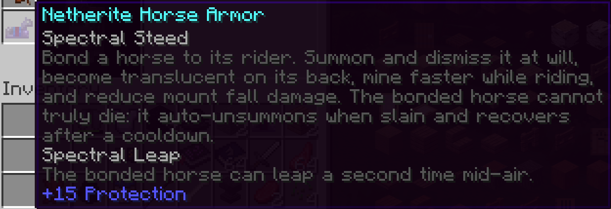
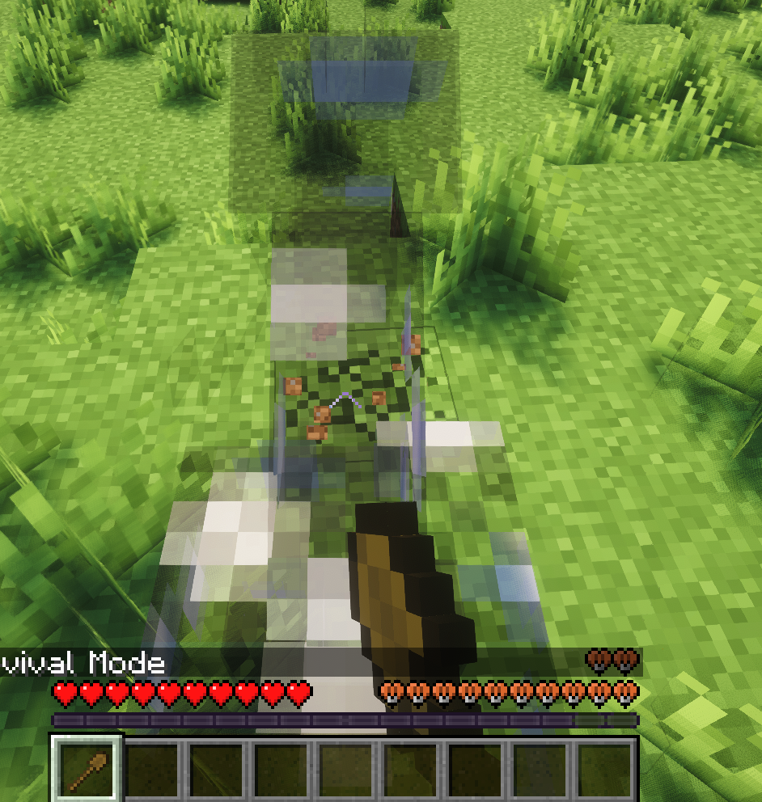
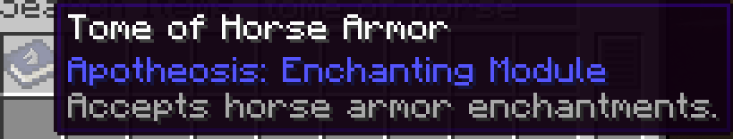

# Seramicx's Elden Horses

A Forge 1.20.1 port of [HughBone's Elden Horses](https://github.com/HughBone/elden-horses) (originally Fabric, MC 1.19.2), heavily expanded upon with Spectral enchantments, an Elden Ring style summon animation, Apotheosis tome compat, and Shiny Horses compat.

<p align="center">
  <a href="https://youtu.be/U2Gf7-xuLw0">
    
  </a>
  <br>
  <em>Animation showcase (click to watch on YouTube)</em>
</p>

## Features

### Spectral enchantments

Two new enchantments that work on any vanilla or modded horse armor (iron, gold, diamond, netherite, etc.):

<p align="center">
  
  <br>
  <em>Both Spectral enchantments on one piece of netherite horse armor, stacking with vanilla Protection.</em>
</p>

- **Spectral Steed**: bond a horse and summon or dismiss it on demand.
  - 1st-person body and armor translucency while riding
  - Mining speed boost on horseback (5x)
  - Mount fall-damage softening
  - Lethal-hit protection: a fatal blow auto-unsummons the horse and starts a configurable recovery cooldown instead of killing it
  - Once bound, the horse is yours; it persists across world reload, death/respawn, and dimension change

<p align="center">
  
  <br>
  <em>1st-person view while riding: body and armor go translucent, mining is accelerated.</em>
</p>

- **Spectral Leap**: mid-air double jump on the bonded horse.

Both enchantments can be obtained from:
- The enchanting table (any horse armor)
- An anvil with an enchanted book
- Chest loot in vanilla and modded chests (configurable rate)

### Summon and unsummon animation

A full 2-second summon animation and 1.2-second unsummon, not just an instant teleport:

- **Custom whistle sound**, with layered enderman teleport and note-block chime audio under it for the materialize effect
- **Whistle pose**: arm raised to mouth, head tilted, while particles converge (driven by PlayerAnimator)
- **Mount animation**: legs swing up horizontally then settle into seated pose, running on a separate animation layer so it doesn't clash with the whistle
- **Render-time vertical offset**: your player visibly rises from ground level into the saddle with a brief overshoot, so it actually looks like you hop on instead of teleporting onto the horse
- **Cyan stardust particles**: saturated cyan dust transitioning to light cyan, sparse soul-fire embers near the ground, kept below 1st-person camera height so the effect never blinds you
- **Horse fades in and out** with translucent alpha animation; the horse materializes around you as you mount and dissolves underneath you as you dismount
- **i-frames** during the active mount and dismount transitions (about 0.6 seconds), covering both the player and the horse so nothing can interrupt the animation mid-way
- **Momentum preservation**: unsummon while galloping and your forward velocity transfers to the player on dismount, so you keep sliding instead of dropping in place

### Tome of Horse Armor (optional Apotheosis compat)

When Apotheosis is installed, an extra item gets registered:

<p align="center">
  
  <br>
  <em>Tome of Horse Armor, registered under the Apotheosis Enchanting module.</em>
</p>

- Appears in the Apotheosis Enchanting creative tab, positioned right after the Boots Tome
- Crafted from 6 books and 1 blaze rod in a 3x3 shaped recipe
- Accepts any enchantment that targets horse armor (Spectral Steed, Spectral Leap, plus Shiny Horses' Protection / Mending / etc.)
- Custom pixel art texture matching Apotheosis's tome aesthetic
- Tooltip wired into Apotheosis's auto-generated info text

If Apotheosis isn't loaded the tome doesn't register at all, so the mod stays clean either way.

### Cross-mod compatibility

- **Shiny Horses Forge**: Shiny Horses' mixin widens vanilla armor enchantment categories to accept horse armor. Our tome filter picks all of those up automatically, so Protection / Mending / Unbreaking / Thorns / Curse of Vanishing stack on the same armor alongside Spectral Steed and Spectral Leap.
- **Apotheosis**: see above.
- **Any mod adding horse armor types**: Spectral enchantments work on any item extending `HorseArmorItem`.

### Loot drops

A Forge global loot modifier injects extra drops into any chest loot table whose path contains `chests/`:

- Spectral Steed and Spectral Leap enchanted books
- Pre-enchanted horse armor (random iron / gold / diamond / netherite tier)
- Drop chance and book-to-armor ratio are config-driven

### Other bits

- **Auto-recovery on summon press**: if your saved cap data is stale (chunk unloaded at login, or you logged out mounted on a vanilla-restored vehicle), the first summon press rebinds the horse instead of failing with "No Horse Found".
- **UUID-based rehydration**: the bonded horse's UUID is always persisted so the cap can reconnect to a wandering live entity after world load.
- **No-depth-write translucent render** for the horse body and armor: block-break crack animations show through the translucent horse instead of being hidden behind it.

## Configuration

Edit `config/elden_horses-common.toml`:

| Key | Default | Effect |
|-----|---------|--------|
| `transparency_alpha` | 0.3 | Horse armor alpha in 1st-person while riding |
| `body_transparency_alpha` | 0.15 | Horse body alpha in 1st-person while riding |
| `chest_drop_chance` | 0.05 | Per-chest chance of a Spectral drop |
| `book_to_armor_ratio` | 0.7 | Share of drops that are books vs pre-enchanted armor |
| `spectral_steed_death_cooldown_seconds` | 300 | Recovery time before re-summon after a Spectral Steed fatal-hit save |

## Required dependencies

- Minecraft 1.20.1
- Forge 47.4.4+
- [PlayerAnimator](https://www.curseforge.com/minecraft/mc-mods/playeranimator) by KosmX, for the whistle and mount animations

## Optional dependencies

- [Apotheosis](https://www.curseforge.com/minecraft/mc-mods/apotheosis): enables the Tome of Horse Armor item and recipe
- [Shiny Horses Forge](https://www.curseforge.com/minecraft/mc-mods/shiny-horses-forge): adds the rest of the vanilla armor enchantments to the horse-armor enchant pool

## Installation

Download the jar from [Releases](https://github.com/Seramicx/seramicx-elden-horses/releases) and drop it in your `mods/` folder alongside PlayerAnimator. Apotheosis and Shiny Horses are optional but recommended.

## Credits and License

Original Fabric implementation by **HughBone**, MIT licensed (see `LICENSE`).
Forge port and feature additions by **Seramicx**.
This port keeps HughBone's MIT license and the `elden_horses` mod ID for save compatibility with the original.

PlayerAnimator by **KosmX** is used as a runtime dependency under its own license.
Apotheosis assets (referenced via lang keys for tome tooltips) belong to **Shadows-of-Fire**; the Apotheosis jar must be sourced separately to build with that compat enabled.

## Build

```
./gradlew build
```

Output: `build/libs/seramicx-elden-horses-1.0.0+forge-1.20.1.jar`

See `libs/README.md` for how to populate the compile-only deps directory (Apotheosis, Placebo, PlayerAnimator jars).
